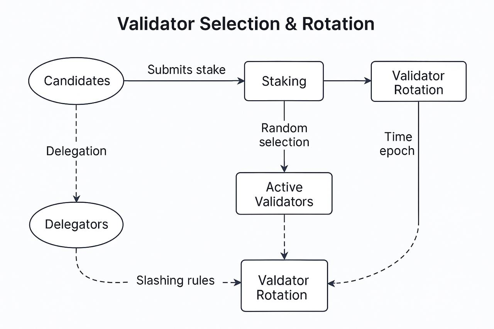
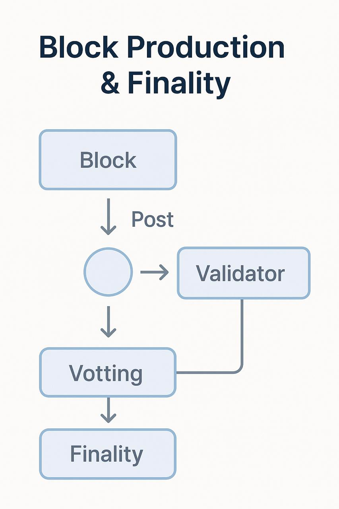
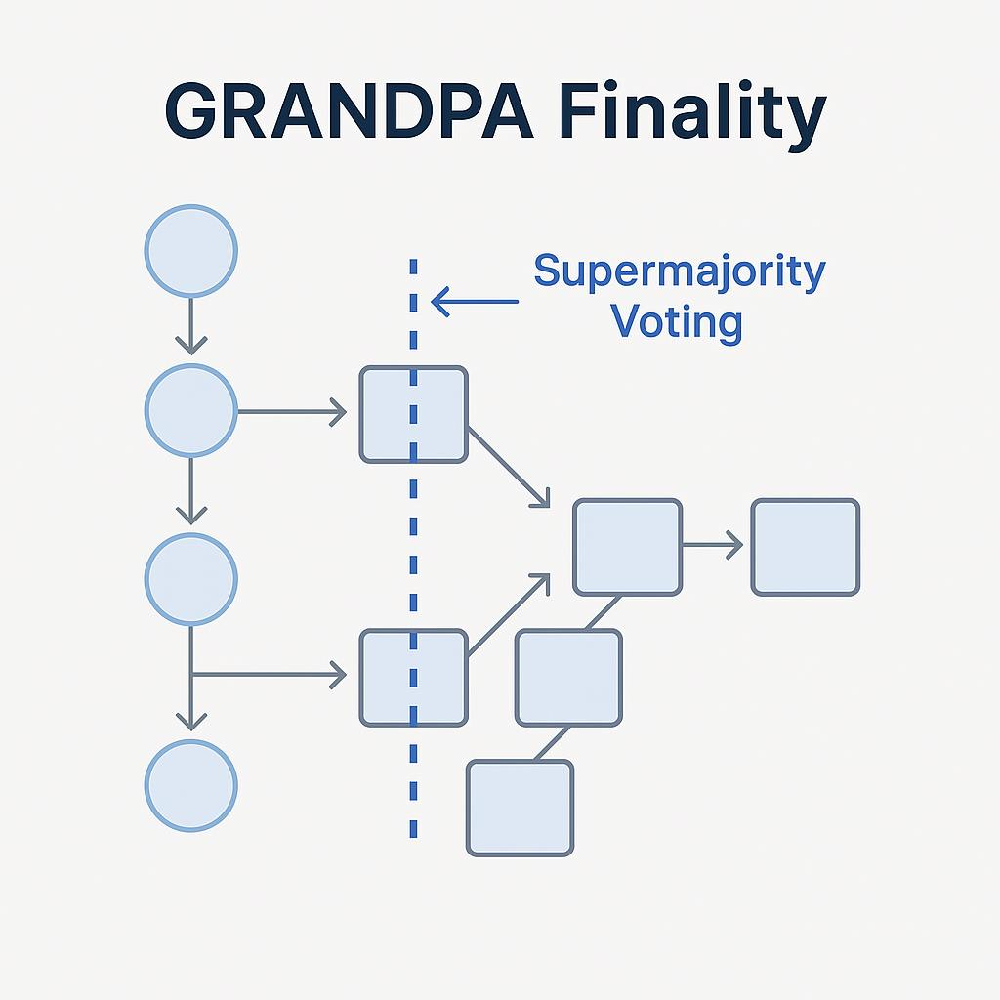
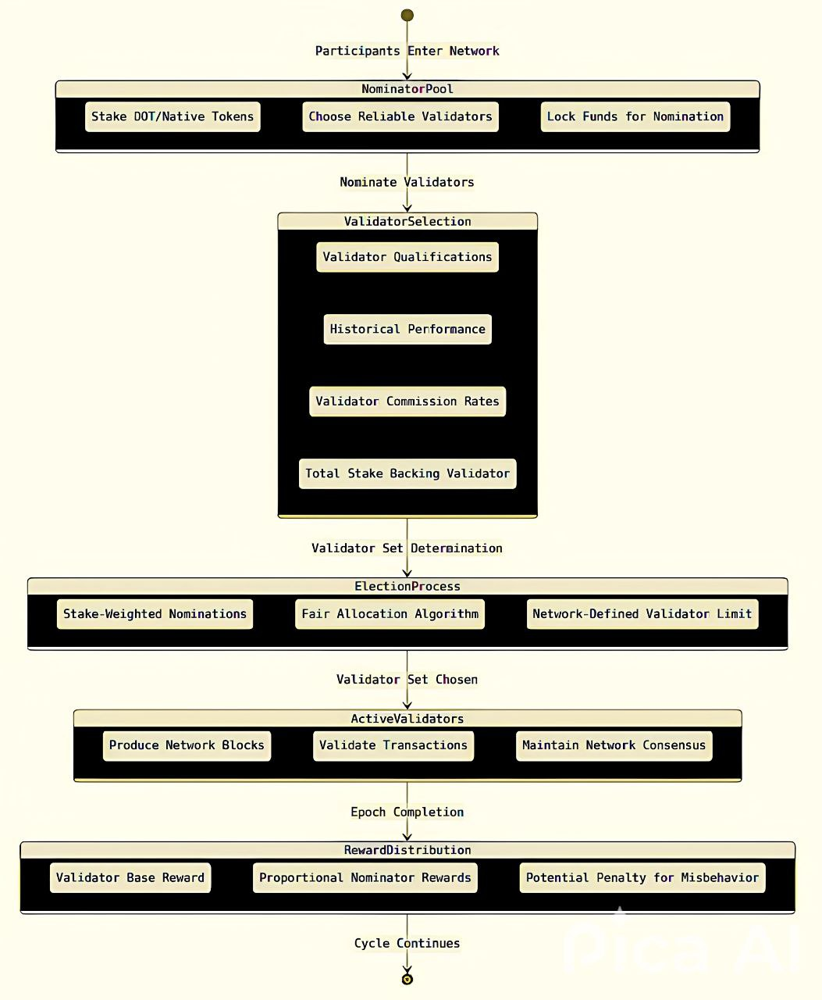
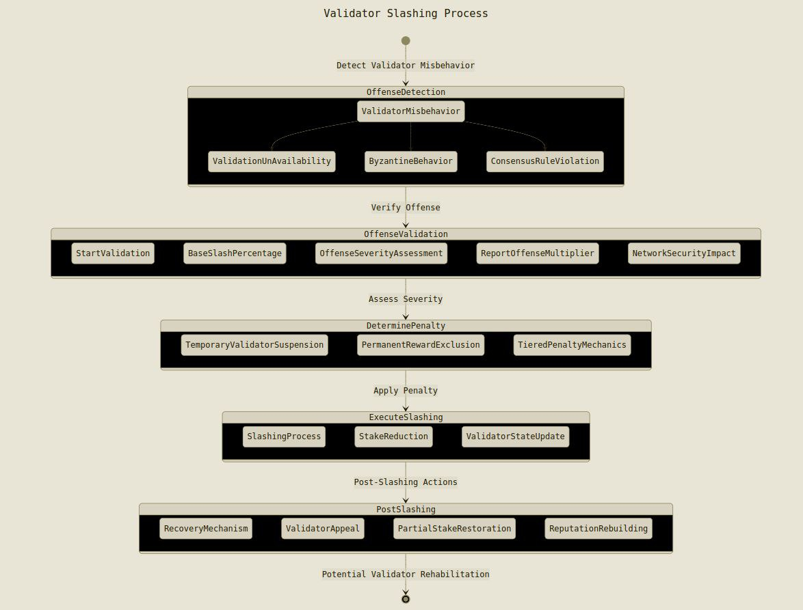

# Consensus Mechanism

Quantova leverages **Pure Proof of Stake (PPoS)**, ensuring secure and efficient block finalization.

## Finality and Block Time

- Block production occurs every **3 seconds**
  
- Finalization depends on network conditions but is typically achieved within seconds, ensuring rapid settlement
- GRANDPA consensus provides deterministic finality
  
  

## Validator Selection & Staking

- Validators must stake tokens to participate in consensus
- Token holders can delegate their stake to trusted validators
- Selection is probabilistic, based on stake weight, ensuring fair distribution
- **Automatic validator rotation** after each era prevents centralization

## Slashing & Validator Penalties

- **Double Signing:** Signing conflicting blocks results in penalties
- **Downtime/Inactivity:** Validators failing to participate risk slashing
- **Malicious Behavior:** Severe violations may lead to removal from the network

### Handling Offline Validators

- GRANDPA requires **2/3 of validators online** to finalize blocks
- Validators missing duties risk slashing or removal

### Recovery from Network Splits

- **Short-term splits:** Majority validators continue finalizing blocks
- **Long-term splits:** Honest validators eventually finalize the longest valid chain

### Consensus Upgrades & Governance

- Token holders and validators vote on network upgrades
- Runtime upgrades modify consensus rules without requiring node restarts
- **Hard Forks** are only used for major security or consensus changes

## Technical Implementation

### Block Production & Consensus Implementation

- **Path:** `https://github.com/Quantova/Quantova/blob/main/node/src/service.rs`
- **Description:** Defines node service, consensus, networking, and synchronization
- **Relevant Modules:** `sc_consensus`, `sc_service`, `BabeBlockImport`

### GRANDPA Finality Implementation

- **Path:** `https://github.com/Quantova/Quantova/blob/main/node/src/chain_spec.rs`
- **Description:** Defines genesis settings and registers GRANDPA authorities
- **Relevant Modules:** `sc_finality_grandpa::GrandpaBlockImport`

### Staking & Validator Selection

- **Path:** `https://github.com/Quantova/Quantova/blob/main/runtime/src/lib.rs`
- **Description:** Manages staking, rewards, and slashing logic

### Validator Rotation & Era Handling

- **Path:** `https://github.com/Quantova/Quantova/blob/main/runtime/src/lib.rs`
- **Description:** Handles validator rotation using `pallet_session`

## Diagrams

### Validator Flow & Selection Process

### Slashing Logic

